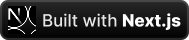

# Similar Songs 🎶

Find 50 AI-matched songs on Spotify that match the vibe of your favorites.

## Features

- Search history
- Song previews
- 50 similar songs
- User friendly searching
- _Spotify playlist integration_ (to-do)

## Preview

Here's a preview of what songs similar to another song look like on the website.

<a aria-label="Similar Songs preview" href="https://similar-songs.itsbruno.dev/song/3gY6tiCNsuVi6s8kPV6aQg">
  
</a>

## Running Locally

### Prerequisites

- Create an application on the [Spotify Developer](https://developer.spotify.com/dashboard/create) website. Copy the **client ID** and the **client secret** and add them to the `.env.local` file (rename the `.env.template` file) as environment variables.
- (Optional) [pnpm package manager](https://pnpm.io)

### Running

> [!NOTE]  
> This project uses pnpm as the package manager, but other package managers can be used as well.

To run this project locally, first install the required packages

```bash
pnpm install
```

Then, run the project in the development environment

```bash
pnpm dev
```

If you want to run the project in the production environment

```bash
pnpm build
pnpm start
```

### Known Issues

#### Some songs don't have a preview sound

This happens sometimes due to licensing reasons or because the preview is only available to logged-in premium users. (see [spotify/web-api/issues/729](https://github.com/spotify/web-api/issues/729#issuecomment-349758014))

### License

[GNU General Public License v3.0](https://choosealicense.com/licenses/gpl-3.0/)

---

<a href="https://nextjs.org"></a>
<a href="https://tailwindcss.com"></a>
<a href="https://spotify.com"></a>
<a href="https://similar-songs.itsbruno.dev"></a>
